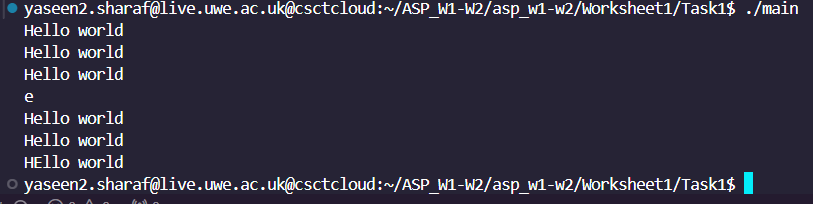
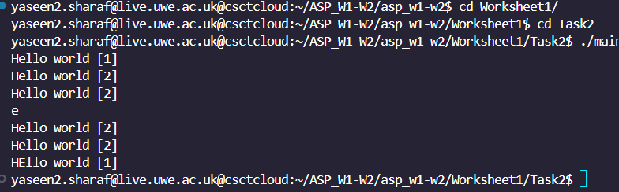
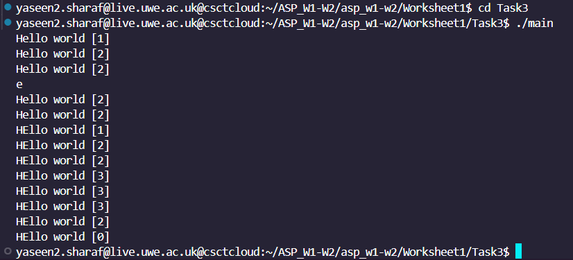
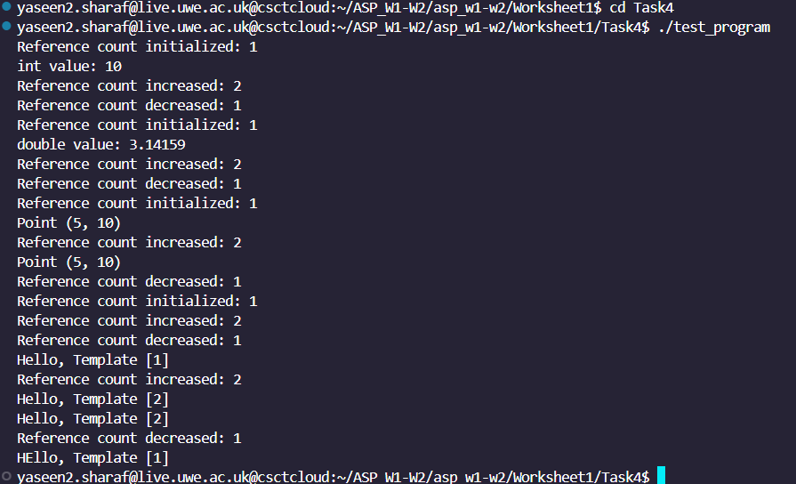

# ASP Worksheet 1

## Getting Started 
```bash
git clone git@gitlab.uwe.ac.uk:y2-sharaf/asp_w1-w2.git
```

## Task 1:My String
Task 1 involves implementing a simplified version of C++'s string class, named my_string. The focus is on dynamic memory allocation and shallow copying, where multiple objects share the same memory, improving memory efficiency. However, this approach also emphasizes the importance of careful memory management, particularly in cases where objects share resources. This task lays the groundwork for more advanced techniques like reference counting, which will be introduced in subsequent tasks to manage memory safely and automatically. Through this exercise, we explore constructors, assignment operators, and destructors, setting the stage for deeper memory management principles in C++.
### Compilation & Execution
To compile and run the code, use the following commands:

```C++
cd asp_w1-w2
```
```C++
cd Worksheet1
```
```C++
cd Task1
```
```C++
clang++ -std=c++17 -o main my_string.cpp filetest_string.cpp
./main
```

### Key Concepts
Dynamic Memory Allocation: Memory for strings is dynamically allocated at runtime, allowing the class to handle strings of varying lengths efficiently.

Shallow Copying: In shallow copying, when an object is copied, it does not create new memory but instead shares the same memory as the original object. This allows both the original and copied objects to reference the same data, enhancing memory usage but also requiring careful management to avoid unintended side effects.

Constructors and Destructor: The implementation includes multiple constructors (default, parameterized, and copy constructor) and an overloaded assignment operator. While the destructor is currently empty, it will become essential in managing memory correctly in future tasks, particularly when dealing with dynamically allocated resources.


## my_string.cpp
```c++
#include "my_string.hpp"

// Default constructor
my_string::my_string() : str(nullptr) {}

// Parameterized constructor
my_string::my_string(const char* s) {
    if (s) {
        str = new char[strlen(s) + 1]; // Allocate memory for the string
        strcpy(str, s); // Copy the input string
    } else {
        str = nullptr;
    }
}

// Copy constructor (shallow copy)
my_string::my_string(const my_string& s) {
    str = s.str; // Share the same memory (shallow copy)
}

// Assignment operator (shallow copy)
my_string& my_string::operator=(const my_string& s) {
    if (this != &s) {
        str = s.str; // Share the same memory (shallow copy)
    }
    return *this;
}

// Destructor (empty for now)
my_string::~my_string() {
    // No memory deallocation yet
}

// Get character at a specific index
char my_string::getChar(const int& i) const {
    if (str && i >= 0 && i < strlen(str)) {
        return str[i];
    }
    return '\0'; // Return null character if index is out of bounds
}

// Set a character at a specific index
void my_string::setChar(const int& i, const char& c) {
    if (str && i >= 0 && i < strlen(str)) {
        str[i] = c;
    }
}

// Print the string
void my_string::print() const {
    if (str) {
        std::cout << str << std::endl;
    } else {
        std::cout << "Empty string" << std::endl;
    }
}

```
## Detailed Implementation

### Default Constructor
```c++
my_string::my_string() : str(nullptr) {
    // Initializes the string pointer to nullptr, indicating an empty string
    // Ensures the object starts in a valid state
}
```
The default constructor initializes an empty my_string object by setting the internal str pointer to nullptr. This ensures that the object is in a valid state even if no string is provided. Using nullptr prevents potential issues related to uninitialized pointers, which can lead to undefined behavior. By setting the pointer to nullptr, the class can later check if a string is present before performing any operations on it.

### Parameterized Constructor
```c++
my_string::my_string(const char* s) {
    if (s) {// Check if the input string is not nullptr
        // Allocate memory dynamically to hold the input string,
        str = new char[strlen(s) + 1];
        // Copy the input string into the allocated memory
        strcpy(str, s);
    } else {
      // If the input string is nullptr
        // Set the internal pointer to nullptr, indicating no memory is allocated
        str = nullptr;
    }
}
```
This constructor takes a C-style string (const char* s) as input, dynamically allocating memory to store the string and copying its contents to the newly allocated memory. The allocation is done using new char[strlen(s) + 1], which ensures enough space is reserved for the string and its null terminator (\0). The strcpy(str, s) function performs a deep copy, ensuring that the my_string object holds its own independent copy of the string data, separate from the original input.

### Copy Constructor (Shallow Copy)
```C++
my_string::my_string(const my_string& s) {
    // Copies the pointer of the string from the source object
    // Both objects will now share the same memory
    str = s.str;
}
```
The copy constructor performs a shallow copy, allowing the copied object to share the same memory as the original. Rather than allocating new memory and duplicating the string, the constructor assigns the new object’s str pointer to the same memory as the original my_string object. This approach optimizes memory usage by avoiding duplication, but both objects now reference the same string data, meaning changes to one will affect the other.

### Assignment Operator (Shallow Copy):
```C++
my_string& my_string::operator=(const my_string& s) {
    if (this != &s) { // Check for self-assignment
        // Copy the pointer of the string from the source object
        // This performs a shallow copy, meaning memory is shared
        str = s.str;
    }
    // Return the current object to allow chaining of assignments
    return *this;
}
```
The assignment operator enables one my_string object to be assigned to another. Similar to the copy constructor, it implements shallow copying, meaning both objects will share the same string memory. The self-assignment check if (this != &s) ensures the object does not assign itself, preventing unnecessary operations or unintended behavior. By performing a shallow copy, the operator ensures that both objects point to the same memory, avoiding memory duplication but also linking the objects to the same data.

### Destructor (Currently Empty):
```C++
   my_string::~my_string() {
    // No memory deallocation happens here
    // Memory leaks will occur because the dynamically allocated memory is not freed
    // Proper cleanup will be implemented in later tasks
}

```
The destructor is intended to free dynamically allocated memory, but it is currently left empty because memory management has not yet been implemented in this task. In second task, the destructor will play a critical role by deallocating memory once no objects are referencing the string, utilizing reference counting to ensure memory is freed only when it is no longer in use. This will prevent memory leaks while ensuring safe and efficient resource management.

### Get Character at a Specific Index:
```C++
char my_string::getChar(const int& i) const {
    if (str && i >= 0 && i < strlen(str)) { // Boundary check for valid index
        return str[i]; // Return the character at the given index
    }
    return '\0'; // Return null character if index is out of bounds or string is empty
}
```
The getChar function retrieves the character at a specified index within the string, incorporating boundary checks to ensure safety. The boundary check verifies that the index is non-negative and within the valid range of the string’s length. If the index is out of bounds, the function returns the null character (\0), preventing access to invalid memory and ensuring robust error handling.

### Set a Character at a Specific Index:
```C++
void my_string::setChar(const int& i, const char& c) {
    if (str && i >= 0 && i < strlen(str)) { // Boundary check for valid index
        str[i] = c; // Update the character at the specified index
    }
    // If the index is invalid, no changes are made to the string
}
```
The setChar function allows modification of the string by setting a specific character at a given index. Like the getChar function, it performs a boundary check to ensure the index is valid, meaning it is non-negative and within the length of the string. This prevents modifying memory outside the valid range of the string, ensuring safe and controlled updates to the string's content.

### Print the String:
```C++
// Print the string
void my_string::print() const {
    if (str) {
        // Print the string if it is not empty
        std::cout << str << std::endl;
    } else {
        // Print a message indicating the string is empty
        std::cout << "Empty string" << std::endl;
    }
}
```
The print function outputs the current contents of the string to the console. If the string is empty (i.e., str is nullptr), it prints "Empty string" to indicate that the object holds no data. This ensures that even in cases where the object has not been assigned a valid string, the function provides a clear and informative message rather than causing unexpected behavior or crashes.

### Testing

### filetest_string.cpp

```C++
#include "my_string.hpp"

int main() {
    my_string s("Hello world");
    s.print();           // Prints "Helloworld"
    {
        my_string t = s; // Shallow copy
        s.print();       // Prints "Hello world"
        t.print();       // Prints "Hello world"
        std::cout << s.getChar(1) << std::endl;  // Prints 'e'
        s.print();       // Prints "Hello world"
        t.print();       // Prints "Hello world"
    }  // 't' goes out of scope here
    s.setChar(1, 'E');   // Modifies the string
    s.print();           // Prints "HEllo world"
}

```
### Expected Output


### Explanation of Output

The initial string is "Helloworld", which is printed twice by s and t, demonstrating the shallow copy.

The character at index 1 is retrieved and printed (e).

After modifying the character at index 1 to 'E', the string becomes "HElloworld".

## Task 2 Reference Counting in my_string Class

Task 2 extends the my_string class from Task 1 by introducing reference counting for automatic memory management. The reference count tracks how many objects share the same string memory, ensuring that memory is only deallocated when no more objects are using it. This allows multiple objects to share the same memory without manual intervention, preventing memory leaks and undefined behavior.
### Compilation & Execution
To compile and run the code, use the following commands:

```C++
cd asp_w1-w2
```
```C++
cd Worksheet1
```
```C++
cd Task2
```
```C++
clang++ -std=c++17 -o main my_string.cpp filetest_string.cpp
./main
```

### Key Concepts
Reference Counting: This mechanism tracks the number of objects referencing a piece of dynamically allocated memory. When the reference count reaches zero, the memory is automatically deallocated.

Shallow Copying with Safety: While objects still share the same memory (shallow copying), reference counting ensures that memory is freed safely when the last object is destroyed or reassigned.

Centralized Memory Management: A helper function (release()) centralizes the logic for releasing memory, ensuring consistent and safe memory handling across the class.

## Code Changes

### 1. Add a Reference Count to the Class:

In my_string.hpp, add a reference count variable:

```C++
class my_string {
public:
    my_string();
    my_string(const char* s);
    my_string(const my_string& s);
    my_string& operator=(const my_string& s);
    ~my_string();

    char getChar(const int& i) const;
    void setChar(const int& i, const char& c);
    void print() const;

private:
    char* str;
    int* ref_count;  // Reference count pointer
};

```
ref_count: This is a pointer to an integer that tracks the number of references to the str memory.

### 2.Helper Function: release()
```C++
void my_string::release() {
    if (ref_count && --(*ref_count) == 0) {
        delete[] str;        // Free string memory
        delete ref_count;    // Free reference count memory
    }
}
;
```
The release() function is designed to decrease the reference count whenever an object is destroyed or re-assigned. If the reference count drops to zero, indicating that no other objects are using the shared memory, it frees both the string memory and the reference count itself. By centralizing the memory deallocation logic in this function, release() ensures that memory is managed safely and consistently, preventing memory leaks and ensuring that resources are only freed when appropriate.

### 3. Modified Constructors and Operators

#### Default Constructor:

```C++
my_string::my_string() : str(nullptr), ref_count(nullptr) {}
```
Initializes an empty my_string object with nullptr for both the string and the reference count.

#### Parameterized Constructor:
```C++
my_string::my_string(const char* s) {
    if (s) {
        str = new char[strlen(s) + 1];
        strcpy(str, s);
        ref_count = new int(1);  // Reference count starts at 1
    } else {
        str = nullptr;
        ref_count = nullptr;
    }
}
```
Allocates memory for the string and initializes the reference count to 1.

#### Copy Constructor:
```C++
my_string::my_string(const my_string& s) {
    str = s.str;               // Shallow copy the string pointer
    ref_count = s.ref_count;   // Share the reference count
    if (ref_count) {
        ++(*ref_count);        // Increment the reference count
    }
}
```
Copies the string pointer and increments the reference count, allowing the new object to share the same string memory.

#### Assignment Operator:
```C++
my_string& my_string::operator=(const my_string& s) {
    if (this != &s) {
        release();  // Release the current memory if needed
        str = s.str;   
        ref_count = s.ref_count;
        if (ref_count) {
            ++(*ref_count);  // Increment the reference count
        }
    }
    return *this;
}
```
The assignment operator ensures the current object releases its memory (if necessary) and then assigns the new string and reference count.

#### Destructor:
```C++
my_string::~my_string() {
    release();  // Release memory if reference count reaches 0
}
```
The destructor calls release(), ensuring that memory is freed only when the last reference to the string is destroyed.

#### Test Program

```C++
#include "my_string.hpp"

int main() {
    my_string s("Hello world");  // Create a my_string object with "Hello world"
    s.print();                   // Print: Hello world [1]
    {
        my_string t = s;         // Shallow copy of 's', reference count increases
        s.print();               // Print: Hello world [2] (shared memory)
        t.print();               // Print: Hello world [2]
        std::cout << s.getChar(1) << std::endl;  // Print: e
        s.print();               // Print: Hello world [2]
        t.print();               // Print: Hello world [2]
    }  // 't' goes out of scope, reference count decreases
    s.setChar(1,'E');            // Modify the second character of the string
    s.print();                   // Print: HEllo world [1] (modified string)
}
```
#### Expected Output:

### Explanation of Output:
When the my_string s("Hello world") object is created, the string "Hello world" is assigned to s, and the reference count starts at 1. Inside the block, my_string t = s creates a shallow copy of s, causing both s and t to share the same memory, and the reference count increases to 2. Both objects print "Hello world [2]" as they share the string. The character at index 1, which is "e", is printed. When the block ends, t goes out of scope, reducing the reference count back to 1, as only s remains. No output is generated at this point, but the reference count decreases internally. Finally, s.setChar(1, 'E') modifies the second character from "e" to "E", resulting in the string "HEllo world", which is printed as "HEllo world [1]", reflecting that only s holds the memory at this point.


## Task 3 – Demonstrating Reference Count of 0

In Task 3, I extend the my_string class to further demonstrate the reference counting mechanism. This task focuses on ensuring that memory is properly managed and deallocated when the reference count reaches zero. The program verifies that as objects go out of scope or are reassigned, the reference count decreases correctly, and memory is freed when no objects are referencing the string.
### Compilation & Execution
To compile and run the code, use the following commands:

```C++
cd asp_w1-w2
```
```C++
cd Worksheet1
```
```C++
cd Task3
```
```C++
clang++ -std=c++17 -o main my_string.cpp filetest_string.cpp
./main
```


### Key Concepts
Reference Counting: This system tracks how many objects are sharing the same string memory. When the reference count reaches zero, the memory is deallocated.

Shallow Copying: Objects can share the same memory without duplicating the string, but the reference count ensures that memory is only freed when all references to the string are gone.

Memory Management: The release() function is used to handle memory deallocation safely when the reference count reaches zero. This prevents memory leaks by ensuring that memory is only freed when it is no longer needed.

## Code Explanation
### 1. Reference Counting:
A ref_count variable tracks how many objects are referencing the string memory. This count increases when objects are copied or assigned and decreases when objects are destroyed or reassigned.
### 2. Memory Management with release():

```C++
void my_string::release() {
    if (ref_count && --(*ref_count) == 0) {
        std::cout << str << " [" << *ref_count << "]" << std::endl;  // Print when ref_count is 0
        delete[] str;        // Free string memory
        delete ref_count;    // Free reference count memory
    }
}
```
The function above  decreases the reference count and deallocates memory when the count reaches zero. It ensures that memory is only freed when no objects are using the string.

### 3. Constructors and Assignment Operator:
The constructors and assignment operator increment the reference count when an object is copied or assigned, and the release() function is called when objects are destroyed or reassigned.

## Test Program
```C++
#include "my_string.hpp"

int main() {
    // Step 1: Create a my_string object with an initial reference count of 1
    my_string s("Hello world");
    s.print();  // Output: Hello world [1]

    {
        // Step 2: Create a new reference to the same string (copy constructor)
        my_string t = s;
        s.print();  // Output: Hello world [2]
        t.print();  // Output: Hello world [2]

        // Step 3: Display the second character in the string
        std::cout << s.getChar(1) << std::endl;  // Output: 'e'
        s.print();  // Output: Hello world [2]
        t.print();  // Output: Hello world [2]
    }  // Step 4: 't' goes out of scope here, so reference count should decrease to 1
    // We should see: Hello world [1]

    // Step 5: Modify the string through 's'
    s.setChar(1, 'E');  // Modify the second character to 'E'
    s.print();  // Output: HEllo world [1]

    {
        // Step 6: Create another reference 'u' from 's'
        my_string u = s;
        s.print();  // Output: HEllo world [2]
        u.print();  // Output: HEllo world [2]

        {
            // Step 7: Create a third reference 'v' from 's' (increment reference count to 3)
            my_string v = s;
            s.print();  // Output: HEllo world [3]
            u.print();  // Output: HEllo world [3]
            v.print();  // Output: HEllo world [3]
        }  // Step 8: 'v' goes out of scope, reference count decreases to 2

        s.print();  // Output: HEllo world [2]
    }  // Step 9: 'u' goes out of scope, reference count decreases back to 1
    // We should see: HEllo world [1]

    // Step 10: At the end of the program, 's' goes out of scope and reference count reaches 0
    // We should see the output: HEllo world [0]
}

```
### Expected Output:


The test program demonstrates how the reference count behaves as objects are created, reassigned, and go out of scope. Initially, a my_string object s is created with the string "Hello world", setting the reference count to 1. A shallow copy t is then created from s, increasing the reference count to 2 as both objects share the same memory. Throughout the program, the reference count adjusts as objects go out of scope or new references are made, increasing when objects are copied and decreasing as objects are destroyed. By the end of the program, once all references are gone and s goes out of scope, the reference count reaches 0, triggering memory deallocation, ensuring proper memory management.


## Task 4: Introducing a Templated Reference Counting Class

In Task 4, I implemented a reusable templated reference counting system using the ReferenceCounted class. This templated class manages dynamic memory and ensures that objects are only deleted when all references to them have been removed. The primary objective of this task is to simplify memory management across various types in C++, ranging from primitive data types like int and double to custom types like point and my_string.

By making the reference counting system templated, we ensure that it can be reused with any type, reducing code duplication and making memory management more consistent across different objects.
### Compilation & Execution
To compile and run the code, use the following commands:
```C++
cd asp_w1-w2
```
```C++
cd Worksheet1
```
```C++
cd Task4
```
```C++
g++ -std=c++17 main.cpp my_string.cpp -o test_program
./test_program
```

### Key Concepts
### 1. Templated Reference Counting:
The ReferenceCounted class is a generic template that works with any type T. It tracks how many objects are referencing a shared piece of memory (i.e., how many copies or assignments have been made).

Purpose: To ensure that dynamically allocated memory is shared and freed only when all references to the object are destroyed. This prevents memory leaks and unnecessary memory allocations.

The class automatically increases the reference count when an object is copied or assigned and decreases it when an object goes out of scope. When the reference count reaches 0, it safely deallocates the memory.
### 2. Automatic Memory Management:
Using this system, you no longer need to manually manage memory with new and delete for each type of object. The ReferenceCounted class ensures that the memory is automatically freed when it’s no longer needed.

This allows for efficient memory usage by sharing resources (e.g., strings) between multiple objects while keeping track of how many objects are still using that memory.

### 3. Reusability:

The key advantage of using a templated reference counting system is reusability. This means you don’t need to re-implement reference counting for every class. The ReferenceCounted class can handle any type, making it a highly flexible and reusable solution.

It works with primitive types (e.g., int, double), custom classes (e.g., point), and user-defined classes like my_string.

### Code Breakdown
#### 1. The ReferenceCounted Template Class
The ReferenceCounted class template manages the reference counting for any data type T. The class ensures that the memory associated with the object is shared between multiple references and freed only when no references remain.
#### Key Methods:
#### Constructor:
This initializes the reference count to 1 when an object is first created. This means there’s exactly one reference to the object at the start.
```C++
ReferenceCounted(T* obj = nullptr) : object(obj), ref_count(nullptr) {
    if (object) {
        ref_count = new int(1);
        std::cout << "Reference count initialized: " << *ref_count << std::endl;
    }
}
```
#### Copy Constructor:
When a ReferenceCounted object is copied (e.g., when you create a new reference or pass it by value), the reference count increases by 1. This ensures that both objects share the same memory, and the memory is not duplicated.
```C++
ReferenceCounted(const ReferenceCounted& other) {
        object = other.object;         // Shallow copy the object pointer
        ref_count = other.ref_count;   // Share the reference count
        if (ref_count) {
            ++(*ref_count);            // Increment reference count
            std::cout << "Reference count increased: " << *ref_count << std::endl;
        }
    }
```
#### Assignment Operator:
Similar to the copy constructor, when a ReferenceCounted object is assigned to another, the reference count increases for the newly assigned object. If the original object had any references, it releases them appropriately.
```C++
// Assignment operator
    ReferenceCounted& operator=(const ReferenceCounted& other) {
        if (this != &other) {
            release();                // Release the current object if needed
            object = other.object;    // Shallow copy the object pointer
            ref_count = other.ref_count;  // Share the reference count
            if (ref_count) {
                ++(*ref_count);       // Increment reference count
                std::cout << "Reference count increased: " << *ref_count << std::endl;
            }
        }
        return *this;
    }
```
#### Destructor:
The destructor ensures that when a ReferenceCounted object goes out of scope, the reference count is decreased by 1. If no references remain (i.e., the reference count is 0), the memory associated with the object is freed.
```C++
~ReferenceCounted() {
        release();  // Release the object when ref count reaches 0
    }

```
#### Release Function:

This function manages memory deallocation. It decreases the reference count and, if no references remain, deletes the associated object and reference count.

```C++
void release() {
        if (ref_count && --(*ref_count) == 0) {
            // Memory release (no message for release)
            delete object;        // Free the object memory
            delete ref_count;     // Free the reference count memory
        } else if (ref_count) {
            std::cout << "Reference count decreased: " << *ref_count << std::endl;
        }
    }
```
### 2. Reworked my_string Class
The my_string class uses the ReferenceCounted<char> template to manage its internal string data. This means the memory for the string is managed by the reference counting system, and the my_string objects share the same string memory when copied or assigned.
#### Constructor:
he constructor initializes the string and wraps it in the ReferenceCounted class to track how many objects share the string memory.


```C++
my_string::my_string(const char* s) {
    if (s) {
        char* str = new char[strlen(s) + 1];
        strcpy(str, s);
        str_ref = ReferenceCounted<char>(str);
    }
}
```
#### Assignment Operator:

The assignment operator allows one my_string object to be assigned to another, making them share the same string memory through the ReferenceCounted<char> object.

```C++
my_string& my_string::operator=(const my_string& s) {
    if (this != &s) {
        str_ref = s.str_ref;// Copy the reference counted object
    }
    return *this;
}

```
### 3. Test Program (main.cpp)
```C++
int main() {
    // Test with int
    ReferenceCounted<int> intRef(new int(10));
    std::cout << "int value: " << *intRef.get() << std::endl;

    {
        ReferenceCounted<int> intRef2 = intRef;  // Copy constructor
    }  // intRef2 goes out of scope

    // Test with double
    ReferenceCounted<double> doubleRef(new double(3.14159));
    std::cout << "double value: " << *doubleRef.get() << std::endl;

    {
        ReferenceCounted<double> doubleRef2 = doubleRef;  // Copy constructor
    }  // doubleRef2 goes out of scope

    // Test with custom class point
    ReferenceCounted<point> pointRef(new point(5, 10));
    pointRef.get()->print();

    {
        ReferenceCounted<point> pointRef2 = pointRef;  // Copy constructor
        pointRef2.get()->print();
    }  // pointRef2 goes out of scope

    // Test with my_string
    my_string s("Hello, Template");
    s.print();

    {
        my_string t = s;  // Copy constructor
        t.print();
        s.print();
    }  // t goes out of scope

    s.setChar(1, 'E');
    s.print();

    return 0;
}
```
The test program demonstrates the use of the ReferenceCounted class with different data types, including int, double, point, and my_string. For each type, the program shows how the reference count increases and decreases as objects are copied and go out of scope.

### Key Tests:

#### 1.Create an int Reference:
A reference-counted integer is created, and the reference count is incremented when a new reference is made.

Output:

```C++
Reference count initialized: 1
int value: 10
Reference count increased: 2
Reference count decreased: 1

```
#### 2.Create a double Reference:

A reference-counted double is created and follows the same process as the integer.

Output:

```C++
Reference count initialized: 1
double value: 3.14159
Reference count increased: 2
Reference count decreased: 1
```
#### 3.Create a point Reference:


Demonstrates reference counting with a custom point class that stores coordinates.

Output:

```C++
Reference count initialized: 1
Point (5, 10)
Reference count increased: 2
Point (5, 10)
Reference count decreased: 1

```
#### 4.Create a my_string Reference:

A my_string object is created using the ReferenceCounted<char> template. Multiple references are created and the reference count behaves as expected, with the string being modified and printed when the reference count drops to 1.

output:

```C++
Reference count initialized: 1
Hello, Template [1]
Reference count increased: 2
Hello, Template [2]
Hello, Template [2]
Reference count decreased: 1
HEllo, Template [1]

```

### Expected Output:


### Summary

In Task 4, I created a templated reference counting system that can manage memory efficiently for different types, including primitive types, custom classes, and user-defined classes like my_string. The ReferenceCounted template automatically manages the reference count, ensuring that objects are shared and memory is deallocated only when no references remain. This provides a flexible and reusable approach to memory management in C++, preventing memory leaks and reducing the need for manual memory handling.

