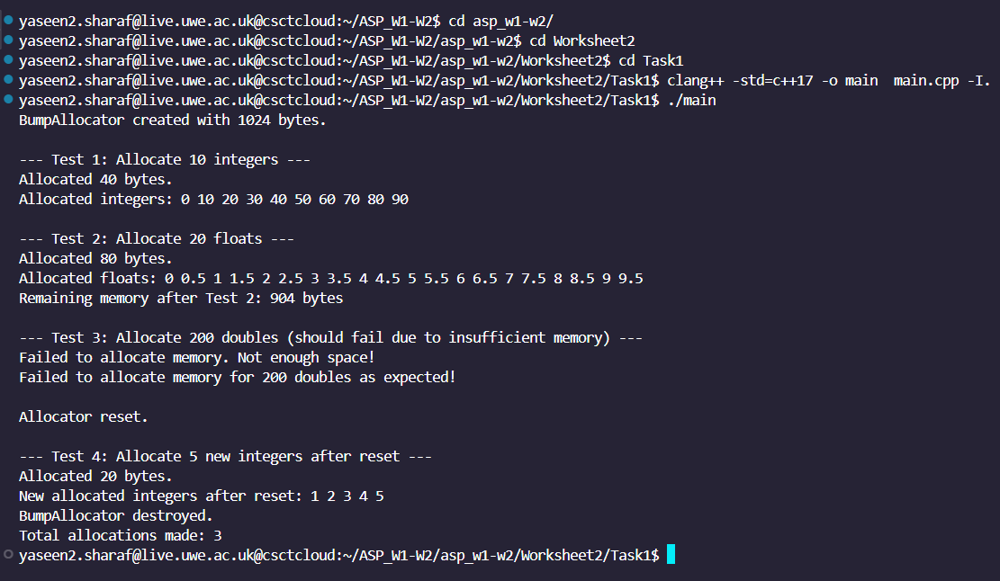
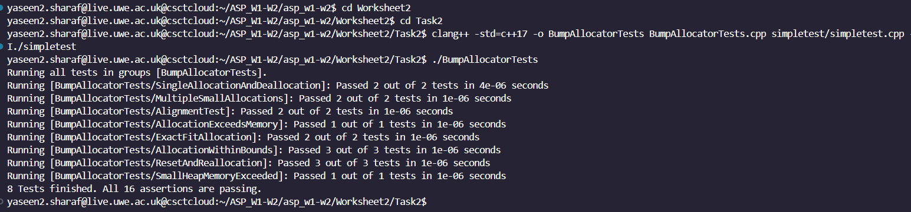
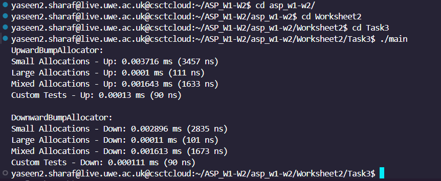
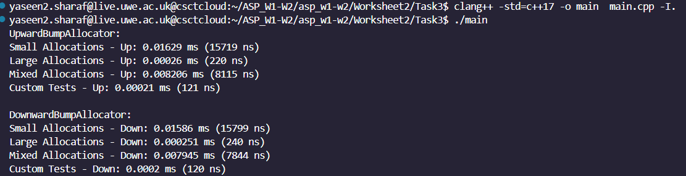
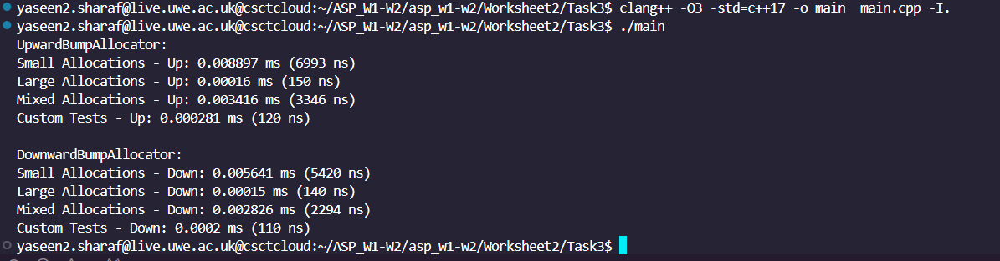

# ASP Worksheet 2

This  worksheet focuses on designing a custom bump allocator in C++ to manage memory allocation efficiently. A bump allocator is a high-performance, lightweight memory allocator, which advances a pointer linearly for each allocation, making it especially effective for workloads with few deallocations until all memory is released at once.

The project consists of three main tasks:

Task 1: Implement an upward-growing bump allocator with a reset feature that allows freeing all allocations in one operation.

Task 2: Develop unit tests using the SimpleTest framework to rigorously validate the allocator’s behavior under various scenarios, including edge cases.

Task 3: Design and conduct benchmarks comparing upward and downward allocation strategies, evaluating performance across diverse allocation patterns.

This project emphasizes critical concepts in C++ memory management, providing hands-on experience in developing, testing, and optimizing custom allocators for efficient resource handling.


## Task 1: Bump Allocator
Task 1 involves implementing a bump allocator in C++ to manage memory efficiently within a fixed-size block. The bump allocator is a simple and high-performance memory allocator, ideal for scenarios where individual memory deallocation isn’t necessary. The allocator works by “bumping” a pointer forward for each allocation, allowing memory to be allocated in constant time.
### Compilation & Execution
To compile and run the code, use the following commands:
```C++
cd asp_w1-w2
```
```C++
cd Worksheet2
```
```C++
cd Task1
```
```C++
g++ -std=c++17 main.cpp my_string.cpp -o test_program
./test_program
```

## BumpAllocator.hpp
```c++
#include <cstddef>
#include <new>         // for std::nothrow
#include <mutex>       // for thread-safety
#include <iostream>    // for debug messages

class BumpAllocator {
public:
    // Constructor to allocate the heap with a custom size
    BumpAllocator(std::size_t heap_size) {
        heap = new char[heap_size];  // Create a heap of given size
        next = heap;                 // Initialize the bump pointer to the start of the heap
        heap_end = heap + heap_size; // Calculate the end of the heap
        allocation_count = 0;
        total_allocations = 0;       // Initialize total allocations count
        total_size = heap_size;
        std::cout << "BumpAllocator created with " << heap_size << " bytes." << std::endl;
    }

    // Destructor to clean up the heap memory and display total allocations
    ~BumpAllocator() {
        delete[] heap;
        std::cout << "BumpAllocator destroyed." << std::endl;
        std::cout << "Total allocations made: " << total_allocations << std::endl;
    }

    // Template method to allocate memory for a specific number of objects with alignment
    template <typename T>
    T* alloc(std::size_t num_objects) {
        std::lock_guard<std::mutex> guard(alloc_mutex);  // Lock for thread-safety

        std::size_t required_size = sizeof(T) * num_objects;
        std::size_t alignment = alignof(T);

        // Align the current bump pointer
        char* aligned_ptr = align_pointer(next, alignment);

        // Check if there is enough space to allocate the requested memory
        if (aligned_ptr + required_size <= heap_end) {
            next = aligned_ptr + required_size;  // Move the bump pointer forward
            allocation_count++;                  // Track active allocations
            total_allocations++;                 // Track total allocations made
            std::cout << "Allocated " << required_size << " bytes." << std::endl;
            return reinterpret_cast<T*>(aligned_ptr);
        }

        std::cout << "Failed to allocate memory. Not enough space!" << std::endl;
        return nullptr; // Not enough memory
    }

    // Deallocate memory (reset the allocator when all allocations are freed)
    void dealloc() {
        std::lock_guard<std::mutex> guard(alloc_mutex);  // Lock for thread-safety

        if (allocation_count > 0) {
            allocation_count--;
        }

        // Reset the allocator if all allocations are freed
        if (allocation_count == 0) {
            next = heap;
            std::cout << "Allocator reset." << std::endl;
        }
    }

    // Method to get the remaining available memory
    std::size_t remaining_memory() const {
        return heap_end - next;
    }

private:
    char* heap;               // Pointer to the start of the heap
    char* next;               // Bump pointer indicating the next free location
    char* heap_end;           // Pointer to the end of the heap
    std::size_t total_size;   // Total size of the heap
    std::size_t allocation_count;   // Current active allocations
    std::size_t total_allocations;  // Total allocations ever made
    std::mutex alloc_mutex;         // Mutex for thread-safety

    // Align a pointer to the required alignment
    char* align_pointer(char* ptr, std::size_t alignment) const {
        std::size_t mask = alignment - 1;
        std::size_t misalignment = reinterpret_cast<std::uintptr_t>(ptr) & mask;
        if (misalignment != 0) {
            ptr += (alignment - misalignment); // Move the pointer to the aligned position
        }
        return ptr;
    }
};

```
## Detailed Implementation

The BumpAllocator class, defined in BumpAllocator.hpp, enables effective memory allocation within a fixed-size memory block. Here’s an explanation of its components and functions, followed by a breakdown of its key methods:

### Key Data Members
heap: A pointer to the start of the allocated memory block that the allocator manages.

next: The bump pointer, initialized at the start of the heap. This pointer advances each time memory is allocated, marking the next available free location.

heap_end: A pointer to the end of the memory block, marking the boundary beyond which memory allocations cannot occur.

allocation_count and total_allocations: Counters that track the number of active allocations and the total allocations made, respectively.

alloc_mutex: A mutex to ensure that allocation operations are thread-safe

### Constructor and Destructor

The constructor and destructor of the BumpAllocator class handle the initialization and cleanup of the allocator’s memory block. These methods are essential to setting up the allocator with a fixed memory size and ensuring that all allocated memory is released when the allocator is destroyed.

#### Constructor: Initialization of the Allocator
The BumpAllocator constructor takes a parameter heap_size and allocates a memory block of that size. This allocated block will serve as the entire memory space that the allocator manages.

```c++
BumpAllocator(std::size_t heap_size) {
    heap = new char[heap_size];
    next = heap;
    heap_end = heap + heap_size;
    allocation_count = 0;
    total_allocations = 0;
    std::cout << "BumpAllocator created with " << heap_size << " bytes." << std::endl;
}
```
The constructor performs several essential tasks to initialize the allocator. First, it allocates a contiguous memory block of heap_size, providing the complete memory space for all subsequent allocations. It sets the next pointer to the start of this block, designating the initial location for allocations and incrementally moving forward with each allocation. To ensure that allocations stay within the defined memory limits, the heap_end pointer is set to mark the end boundary of the memory block, preventing overflow by halting allocations that exceed this boundary. Additionally, allocation_count and total_allocations are both initialized to zero, where allocation_count tracks active allocations and total_allocations records the cumulative number of allocations made. Together, these elements ensure precise tracking of memory usage and safe management of the allocator’s lifecycle.

#### Destructor: Cleanup of the Allocator.
The destructor is responsible for releasing the memory allocated for the heap when the BumpAllocator object is destroyed. It provides a clean and controlled shutdown for the allocator, ensuring efficient memory deallocation and preventing memory leaks.

```c++
// Destructor to clean up the heap memory and display total allocations
    ~BumpAllocator() {
        delete[] heap;
        std::cout << "BumpAllocator destroyed." << std::endl;
        std::cout << "Total allocations made: " << total_allocations << std::endl;
    }
```
The destructor performs essential tasks to ensure proper memory cleanup and tracking. First, it deallocates the memory block allocated to heap using delete[] heap;, effectively freeing the entire region of memory managed by the allocator and ensuring no memory leaks occur. It then prints a message, "BumpAllocator destroyed.", to confirm that the cleanup process has completed, which can be useful for tracking the allocator's lifecycle during debugging or testing. Finally, it displays the total number of allocations made (total_allocations), providing a summary of the allocator’s usage over its lifetime. This summary acts as a quick check for monitoring memory usage and verifying that all allocations were handled correctly within the program.

### Memory Allocation with alloc

The primary function in the bump allocator is alloc, which allocates memory for a specified number of objects of a particular type, ensuring proper alignment.

```c++
template <typename T>
T* alloc(std::size_t num_objects) {
    std::lock_guard<std::mutex> guard(alloc_mutex);

    std::size_t required_size = sizeof(T) * num_objects;
    std::size_t alignment = alignof(T);

    char* aligned_ptr = align_pointer(next, alignment);

    if (aligned_ptr + required_size <= heap_end) {
        next = aligned_ptr + required_size;
        allocation_count++;
        total_allocations++;
        std::cout << "Allocated " << required_size << " bytes." << std::endl;
        return reinterpret_cast<T*>(aligned_ptr);
    }

    std::cout << "Failed to allocate memory. Not enough space!" << std::endl;
    return nullptr;
}

```
Step-by-Step Explanation of alloc:

1.Thread-Safety with Mutex: The function begins by locking a mutex to ensure thread-safe allocation.

2.Calculate Required Memory: Determines the total bytes needed by multiplying the size of T with num_objects.

3.Alignment Check: Calls align_pointer to ensure that the next pointer is correctly aligned for the type being allocated. Misaligned memory can lead to performance penalties or even runtime errors, so alignment is essential.

4.Boundary Check: Checks if the allocation fits within the remaining space by comparing aligned_ptr + required_size with heap_end.

5.Advance next Pointer: If the allocation succeeds, moves the next pointer to the next free location in memory and updates allocation counters.

6.Return Pointer: Returns a pointer to the allocated memory or nullptr if there isn’t enough space.

### Alignment Helper (align_pointer)
This function ensures memory alignment by adjusting the next pointer as needed:
```c++
  // Align a pointer to the required alignment
    char* align_pointer(char* ptr, std::size_t alignment) const {
        std::size_t mask = alignment - 1;
        std::size_t misalignment = reinterpret_cast<std::uintptr_t>(ptr) & mask;
        if (misalignment != 0) {
            ptr += (alignment - misalignment); // Move the pointer to the aligned position
        }
        return ptr;
    }
;

```
### Resetting Memory with dealloc

The bump allocator uses a simplified reset approach for deallocation, where memory is freed only after all allocations are complete:

```c++
 // Deallocate memory (reset the allocator when all allocations are freed)
    void dealloc() {
        std::lock_guard<std::mutex> guard(alloc_mutex);  // Lock for thread-safety

        if (allocation_count > 0) {
            allocation_count--;
        }

        // Reset the allocator if all allocations are freed
        if (allocation_count == 0) {
            next = heap;
            std::cout << "Allocator reset." << std::endl;
        }
    }
```
Explanation:

Allocation Tracking: Decrements allocation_count for each call to dealloc. This count helps determine when to reset.

Full Reset: When allocation_count reaches zero, it resets next back to heap, effectively making the entire block reusable.

## Test Cases (main.cpp)
The following test cases demonstrate key functionalities of the BumpAllocator:

### Test Case 1: Basic Integer Allocation

the first test allocates memory for 10 integers (40 bytes) and initializes each integer to a multiple of 10. After allocation, the values are printed to verify that the memory was allocated and used correctly.

```c++
  // Test 1: Allocate space for 10 integers (40 bytes)
    std::cout << "\n--- Test 1: Allocate 10 integers ---" << std::endl;
    int* int_ptr = allocator.alloc<int>(10);
    if (int_ptr != nullptr) {
        for (int i = 0; i < 10; ++i) {
            int_ptr[i] = i * 10;
        }
        // Print the allocated integers
        std::cout << "Allocated integers: ";
        for (int i = 0; i < 10; ++i) {
            std::cout << int_ptr[i] << " ";
        }
        std::cout << std::endl;
    } else {
        std::cerr << "Failed to allocate memory for 10 integers!" << std::endl;
    }

```
### Test Case 2: Float Allocation and Remaining Memory Check

the second test allocates space for 20 floats (80 bytes) to confirm the allocator’s ability to handle multiple data types. Each float is assigned a value of i * 0.5, and the allocated floats are printed. The test also checks the remaining memory in the allocator to ensure it updates correctly after multiple allocations.

```c++
 // Test 2: Allocate space for 20 floats (80 bytes)
    std::cout << "\n--- Test 2: Allocate 20 floats ---" << std::endl;
    float* float_ptr = allocator.alloc<float>(20);
    if (float_ptr != nullptr) {
        for (int i = 0; i < 20; ++i) {
            float_ptr[i] = i * 0.5f;
        }
        // Print the allocated floats
        std::cout << "Allocated floats: ";
        for (int i = 0; i < 20; ++i) {
            std::cout << float_ptr[i] << " ";
        }
        std::cout << std::endl;
    } else {
        std::cerr << "Failed to allocate memory for 20 floats!" << std::endl;
    }

    // Check remaining memory after the first two allocations
    std::cout << "Remaining memory after Test 2: " << allocator.remaining_memory() << " bytes" << std::endl;
```

### Test Case 3: Allocation Failure Scenario

the thrid test attempt to allocate memory for 200 doubles, requiring 1600 bytes, which exceeds the allocator’s capacity of 1024 bytes. This ensures that the allocator handles over-allocation gracefully by returning nullptr and does not compromise memory integrity.

```c++
  // Test 3: Attempt to allocate more memory than available
    std::cout << "\n--- Test 3: Allocate 200 doubles (should fail due to insufficient memory) ---" << std::endl;
    double* double_ptr = allocator.alloc<double>(200);  // This requires 1600 bytes, more than available
    if (double_ptr == nullptr) {
        std::cout << "Failed to allocate memory for 200 doubles as expected!" << std::endl;
    }
```
### Test Case 4: Reset and Reallocation

After calling dealloc(), the allocator resets, allowing memory to be reused for new allocations.The fourth test allocates memory for 5 integers after the reset to confirm that the allocator can correctly handle memory reuse.

```c++
// Reset the allocator and make a new allocation to verify reset functionality
    allocator.dealloc();  // Reset all allocations
    std::cout << "\nAllocator reset.\n\n";

    // New allocation after reset
    std::cout << "--- Test 4: Allocate 5 new integers after reset ---" << std::endl;
    int* new_int_ptr = allocator.alloc<int>(5);
    if (new_int_ptr != nullptr) {
        for (int i = 0; i < 5; ++i) {
            new_int_ptr[i] = i + 1;
        }
        // Print the new allocated integers
        std::cout << "New allocated integers after reset: ";
        for (int i = 0; i < 5; ++i) {
            std::cout << new_int_ptr[i] << " ";
        }
        std::cout << std::endl;
    } else {
        std::cerr << "Failed to allocate memory for new 5 integers after reset!" << std::endl;
    }
```


### Expected Output:


### Summary

In Task 1, a custom bump allocator in C++ was implemented to efficiently manage memory within a fixed-size block, advancing a pointer for each allocation. The allocator performs alignment, checks memory boundaries, and locks each allocation operation to ensure thread safety. Additionally, a reset function allows all allocations to be freed simultaneously, enabling memory reuse. Tested under various allocation scenarios, the allocator demonstrated effectiveness in sequential memory allocation where frequent deallocation is unnecessary.

## Task2 Unit Tests
Task 2 focuses on rigorously testing the BumpAllocator class using the SimpleTest framework. This series of unit tests is designed to validate that the allocator performs correctly across a range of scenarios, including single and multiple allocations, alignment, handling of boundary limits, and deallocation. Each test case asserts specific outcomes, allowing verification that the allocator can manage typical and edge cases, while providing clear feedback on its behavior and limitations.
### Compilation & Execution
To compile and run the code, use the following commands:
```C++
cd asp_w1-w2
```
```C++
cd Worksheet2
```
```C++
cd Task2
```
```C++
clang++ -std=c++17 -o BumpAllocatorTests BumpAllocatorTests.cpp simpletest/simpletest.cpp -I./simpletest
./BumpAllocatorTests 
```

### Test Cases BumpAllocatorTests.cpp
The following test cases cover key aspects of BumpAllocator functionality:

### Single Allocation and Deallocation
This test ensures that a single integer allocation followed by deallocation correctly resets the allocator. It first allocates space for one integer, then calls dealloc() to reset the allocator. The test verifies that the remaining memory equals the initial heap size (20 bytes in this case), confirming that all allocated memory has been successfully freed, indicating a proper reset.

```c++
DEFINE_TEST_G(SingleAllocationAndDeallocation, BumpAllocatorTests) {
    BumpAllocator allocator(20, false);
    int* int_ptr = allocator.alloc<int>(1);
    TEST_MESSAGE(int_ptr != nullptr, "Failed to allocate memory for a single integer!");
    allocator.dealloc();
    TEST_MESSAGE(allocator.remaining_memory() == 20, "Allocator did not reset correctly after single allocation deallocation!");
}
```
### Multiple Small Allocations
This test verifies that the allocator can handle multiple allocations within the available memory. It allocates three integers within a small memory block and checks that each allocation succeeds. After each allocation, it also verifies that the remaining memory is accurately tracked, confirming the allocator's ability to manage multiple small allocations efficiently within a limited memory space.

```c++
DEFINE_TEST_G(MultipleSmallAllocations, BumpAllocatorTests) {
    BumpAllocator allocator(50, false);
    int* int_ptr1 = allocator.alloc<int>(1);
    int* int_ptr2 = allocator.alloc<int>(1);
    int* int_ptr3 = allocator.alloc<int>(1);
    TEST_MESSAGE(int_ptr1 != nullptr && int_ptr2 != nullptr && int_ptr3 != nullptr, "Failed small allocations!");
    TEST_MESSAGE(allocator.remaining_memory() == 38, "Remaining memory not as expected after small allocations.");
}
```
### Alignment Test for Different Types

This test ensures that memory allocated for different data types is aligned correctly, which is essential for performance and preventing runtime errors. The allocator is tested by allocating memory for char, int, and double types, checking that each allocation is aligned according to the type's requirements. This test verifies that the bump allocator respects type alignment within the available memory, thus demonstrating its reliability for varied data types.
```c++
DEFINE_TEST_G(AlignmentTest, BumpAllocatorTests) {
    BumpAllocator allocator(40, false);
    char* char_ptr = allocator.alloc<char>(1);
    int* int_ptr = allocator.alloc<int>(1);
    double* double_ptr = allocator.alloc<double>(1);
    TEST_MESSAGE(char_ptr != nullptr && int_ptr != nullptr && double_ptr != nullptr, "Failed allocation with alignment!");
    TEST_MESSAGE(allocator.remaining_memory() < 40, "Remaining memory does not match expected value after aligned allocations.");
}

```
### Allocation Failure due to Insufficient Memory
This test confirms that the allocator fails gracefully when a requested allocation exceeds the available memory. Attempting to allocate 60 bytes within a 50-byte heap, this test expects the allocator to return nullptr when insufficient memory is available. This test validates that the allocator can handle over-allocation requests appropriately without compromising memory integrity.
```c++
DEFINE_TEST_G(AllocationExceedsMemory, BumpAllocatorTests) {
    BumpAllocator allocator(50, false);
    int* int_ptr = allocator.alloc<int>(15); // Requires 60 bytes, exceeds the 50-byte limit
    TEST_MESSAGE(int_ptr == nullptr, "Allocation succeeded unexpectedly when exceeding memory limit!");
}
```
### Exact Fit Allocation

This test checks if the allocator can manage an allocation that precisely fits the remaining memory space. It allocates 40 bytes within a 40-byte memory block and verifies that no memory is left after the allocation. This test demonstrates that the allocator can handle edge cases where the requested memory exactly matches the available space, thus ensuring optimal memory usage.
```c++
DEFINE_TEST_G(ExactFitAllocation, BumpAllocatorTests) {
    BumpAllocator allocator(40, false);
    int* int_ptr = allocator.alloc<int>(10); // Allocates 40 bytes
    TEST_MESSAGE(int_ptr != nullptr, "Failed to allocate memory for 10 integers with exact fit!");
    TEST_MESSAGE(allocator.remaining_memory() == 0, "Remaining memory not zero after exact fit allocation.");
}
```
### Allocation within Bounds and Remaining Memory Check
This test validates that the allocator can manage multiple allocations while ensuring memory boundaries are respected. It allocates 40 bytes each for integers and floats within a 100-byte heap and then checks if the remaining memory accurately reflects the used space. This test confirms that the allocator can efficiently allocate and track memory within bounds, maintaining consistent memory availability information.

```c++
DEFINE_TEST_G(AllocationWithinBounds, BumpAllocatorTests) {
    BumpAllocator allocator(100, false);
    int* int_ptr = allocator.alloc<int>(10); // 40 bytes
    float* float_ptr = allocator.alloc<float>(10); // 40 bytes
    TEST_MESSAGE(int_ptr != nullptr && float_ptr != nullptr, "Failed to allocate memory within bounds!");
    TEST_MESSAGE(allocator.remaining_memory() == 20, "Remaining memory does not match expected value of 20 bytes.");
}

```
### Reset Allocator and Verify Reallocation after Deallocation
This test checks the allocator’s ability to reset and handle memory reuse after deallocation. Initially, it allocates 40 bytes, resets the allocator, and verifies that the remaining memory equals the initial heap size. After the reset, it allocates 20 bytes to confirm that the allocator correctly recycles memory for new allocations, ensuring efficient memory reuse.

```c++
DEFINE_TEST_G(ResetAndReallocation, BumpAllocatorTests) {
    BumpAllocator allocator(100, false);
    int* int_ptr = allocator.alloc<int>(10); // Allocates 40 bytes
    allocator.dealloc(); // Reset the allocator
    TEST_MESSAGE(allocator.remaining_memory() == 100, "Allocator did not reset correctly after deallocation!");
    int* new_int_ptr = allocator.alloc<int>(5); // Allocate 20 bytes after reset
    TEST_MESSAGE(new_int_ptr != nullptr, "Failed to allocate memory after reset!");
}
```
### Small Heap Memory Exceeded

This test verifies that the allocator properly handles allocations that exceed the heap size. With a 10-byte heap, it attempts to allocate 12 bytes, confirming that the allocator returns nullptr when there is insufficient memory. This test ensures that the allocator consistently enforces heap size limitations, preventing unintended memory overflows.

```c++
DEFINE_TEST_G(SmallHeapMemoryExceeded, BumpAllocatorTests) {
    BumpAllocator allocator(10, false);
    int* int_ptr = allocator.alloc<int>(3); // Requires 12 bytes, exceeds the 10-byte limit
    TEST_MESSAGE(int_ptr == nullptr, "Allocation succeeded unexpectedly on small heap exceeding available memory!");
}
```
### Expected Output

### Summary
Task 2 comprehensively tests the BumpAllocator, ensuring reliable performance under typical and boundary conditions. Targeted unit tests confirm that the allocator efficiently handles data type alignment, memory tracking, accurate deallocation, and fails gracefully on exceeding memory requests. These tests validate the allocator's robustness, confirming it as a dependable memory management solution across diverse scenarios.

### Task 3:Benchmarking Upward and Downward Bump Allocators

Task 3 is centered on benchmarking two types of bump allocators—an upward-growing allocator (BumpAllocatorUpwards) and a downward-growing allocator (BumpAllocatorDownwards)—to evaluate their performance in different memory allocation scenarios. By implementing a benchmarking framework (Benchmark.hpp), i can systematically measure the time each allocator takes to handle a range of allocation patterns. This helps us understand their efficiency, alignment behavior, and suitability for various types of workloads.

### Compilation & Execution
To compile and run the code, use the following commands:
```C++
cd asp_w1-w2
```
```C++
cd Worksheet2
```
```C++
cd Task3
```
```C++
clang++ -std=c++17 -o main  main.cpp -I.
 ./main
```

### Components of Task 3

Benchmark.hpp: The Benchmark class provides two functions, measure_time_ms and measure_time_ns, to measure function execution time in milliseconds and nanoseconds, respectively. These methods capture start and end times for each function and calculate the duration, providing a detailed look at allocation time for each scenario.

BumpAllocatorUpwards.hpp: Defines BumpAllocatorUpwards, which handles memory allocation by sequentially moving a pointer upward from the start to the end of a fixed heap. Each allocation moves the pointer forward by the requested size, which makes this allocator very efficient for continuous memory allocations where memory isn’t frequently deallocated.

BumpAllocatorDownwards.hpp: Defines BumpAllocatorDownwards, which handles memory allocation by moving a pointer downward from the end of the heap toward the beginning. This alternative strategy offers flexibility in certain use cases where memory usage is dynamic or where separation between regions is beneficial.

main.cpp: Implements the benchmarking suite that defines different allocation scenarios (patterns) and applies them to both allocators. Each benchmark pattern simulates common allocation behaviors, such as small, large, and mixed-size allocations, which reflect real-world memory usage patterns.

### Code Walkthrough
### 1.Benchmarking Functionality in Benchmark.hpp

The Benchmark class includes the following methods for measuring time:

measure_time_ms: Measures the execution time of a function in milliseconds.

measure_time_ns: Measures the execution time of a function in nanoseconds.

The measure_time_ms method is useful for longer-running operations, providing time in milliseconds, while measure_time_ns offers nanosecond precision for very quick operations. These dual options allow benchmarking of both lengthy and brief tasks effectively.

```c++
template <typename Func, typename... Args>
static double measure_time_ms(Func func, Args&&... args) {
    auto start = std::chrono::high_resolution_clock::now();
    func(std::forward<Args>(args)...);
    auto end = std::chrono::high_resolution_clock::now();
    std::chrono::duration<double, std::milli> duration = end - start;
    return duration.count();  // Return duration in milliseconds
}

template <typename Func, typename... Args>
static double measure_time_ns(Func func, Args&&... args) {
    auto start = std::chrono::high_resolution_clock::now();
    func(std::forward<Args>(args)...);
    auto end = std::chrono::high_resolution_clock::now();
    std::chrono::duration<double, std::nano> duration = end - start;
    return duration.count();  // Return duration in nanoseconds
}

```

Each function starts by recording the start time with std::chrono::high_resolution_clock::now(), then runs the function, records the end time, and calculates the duration. This enables precise benchmarking for each allocation scenario.

### 2.BumpAllocatorUpwards.hpp
```C++
 // Constructor: Initializes the allocator with a fixed heap size
    BumpAllocatorUpwards(std::size_t heap_size) {
        heap = new char[heap_size];      // Allocate memory for the heap
        next = heap;                    // Set the bump pointer to the start of the heap
        heap_end = heap + heap_size;    // Mark the end of the heap
        allocation_count = 0;           // Initialize allocation counter
        total_allocations = 0;          // Initialize total allocations counter
        // Debug message (commented out for cleaner output)
        // std::cout << "BumpAllocatorUpwards created with " << heap_size << " bytes." << std::endl;
    }
```
This file defines the BumpAllocatorUpwards class, an upward-growing bump allocator designed to manage a fixed-size heap efficiently. Key members include heap, a pointer to the start of the heap memory, next, a pointer that moves forward with each allocation to mark the next available space, and heap_end, which marks the boundary beyond which allocations cannot occur. The alloc method in this class ensures that memory alignment requirements are met before advancing the next pointer by the required allocation size. If allocation is successful, next is updated to point to the new free space after the allocated memory. The dealloc method resets next back to the start of the heap if no active allocations are present, making the entire heap available for future allocations.

#### 3.BumpAllocatorDownwards.hpp
```C++
// Constructor: Initializes the allocator with a fixed heap size
    BumpAllocatorDownwards(std::size_t heap_size) {
        heap = new char[heap_size];      // Allocate memory for the heap
        next = heap + heap_size;         // Set the bump pointer to the end of the heap
        heap_end = heap + heap_size;     // Mark the end of the heap
        heap_start = heap;               // Mark the start of the heap
        allocation_count = 0;            // Initialize allocation counter
        total_allocations = 0;           // Initialize total allocations counter
        // Debug message (commented out for cleaner output)
        // std::cout << "BumpAllocatorDownwards created with " << heap_size << " bytes." << std::endl;
    }

```
This file defines the BumpAllocatorDownwards class, which implements a downward-growing allocation strategy. While similar in structure to BumpAllocatorUpwards, this class allocates memory by moving the next pointer from heap_end towards heap_start, effectively reducing available space from the top of the heap downwards. The alloc method adjusts next backwards according to the alignment and allocation size, stopping if it reaches heap_start to prevent overflow. This approach can be advantageous in scenarios where separate regions within the heap need to be isolated, such as when managing distinct types of memory allocations within the same heap space.

### 4.main.cpp - Benchmarking Suite
In main.cpp, each allocation pattern tests the performance of both BumpAllocatorUpwards and BumpAllocatorDownwards under different scenarios. Let’s walk through each pattern with the code to understand what is being tested.

#### Small Allocations

The small_allocations function tests the allocators with multiple small memory requests. The function allocates space for one integer repeatedly in a loop, simulating a scenario where the system needs to handle many small allocations in quick succession. This tests the efficiency and speed of the allocator when handling numerous small allocations.

```c++
template <typename Allocator>
void small_allocations(Allocator& allocator) {
    for (int i = 0; i < 1000; ++i) {  // Allocate 1 integer 1000 times
        allocator.template alloc<int>(1);
    }
    allocator.dealloc();  // Reset allocator after all allocations
}
```

#### Large Allocations

In The large_allocations function, I test how the allocator performs when dealing with fewer, but larger, allocations. Here, memory is allocated for 100 integers at a time, repeated 10 times. This setup is helpful to evaluate if the allocator can handle larger memory blocks and to observe how it behaves when the allocations require substantial space within the heap.

```c++
template <typename Allocator>
void large_allocations(Allocator& allocator) {
    for (int i = 0; i < 10; ++i) {  // Allocate 100 integers 10 times
        allocator.template alloc<int>(100);
    }
    allocator.dealloc();  // Reset allocator after all allocations
}
```
#### Mixed Allocations

This pattern combines both small and large allocations, alternating between them. Here, memory for a single integer is allocated 500 times, followed by larger allocations (200 integers each) 5 times. This setup emulates a more dynamic and unpredictable real-world scenario, where the allocator might need to manage a mix of small and large allocations. It tests the allocator’s flexibility and its ability to handle a variety of allocation sizes in succession.

```c++
template <typename Allocator>
void mixed_allocations(Allocator& allocator) {
    for (int i = 0; i < 500; ++i) {  // First, allocate 1 integer 500 times
        allocator.template alloc<int>(1);
    }
    for (int i = 0; i < 5; ++i) {  // Then, allocate 200 integers 5 times
        allocator.template alloc<int>(200);
    }
    allocator.dealloc();  // Reset allocator after all allocations
}

```
#### Custom Tests

The custom_tests function allocates memory for various data types and sizes, including integers, doubles, and floats. The purpose is to see how the allocator handles different data types and alignment requirements. This can reveal how well the allocator manages alignment for different sizes and types, providing insights into its behavior in diverse scenarios.

```c++
template <typename Allocator>
void custom_tests(Allocator& allocator) {
    allocator.template alloc<int>(50);    // Allocate 50 integers
    allocator.template alloc<double>(20); // Allocate 20 doubles
    allocator.template alloc<float>(100); // Allocate 100 floats
    allocator.dealloc();  // Reset allocator after all allocations
}
```
### Expected Outcomes

Each allocator is tested under the four scenarios, with timing results for both milliseconds and nanoseconds. Here are the typical expected outcomes:



### Interpretation of Results

1. Small Allocations:
The DownwardBumpAllocator shows a slight performance edge with small allocations, making it potentially better suited for scenarios with high-frequency, small-sized memory requests. This advantage likely stems from the way it allocates memory by moving the pointer downwards, which may have slightly less overhead in certain architectures.

2. Large Allocations:
Both allocators show equally fast performance in handling large allocations, with differences being negligible. This result suggests that the allocation direction (upward or downward) has minimal impact on performance for large memory blocks, making either allocator suitable for applications requiring fewer, larger allocations.

3. Mixed Allocations:
For mixed allocation patterns, both allocators perform similarly, handling the dynamic allocation sizes effectively. This makes both allocators flexible and dependable in scenarios where applications have a mix of small and large allocations, such as real-time processing or interactive applications.

4. Custom Tests:
The allocators perform identically in custom tests involving diverse data types and alignment requirements. This indicates that both allocators manage memory alignment well, supporting scenarios with varied data types, such as scientific or graphical applications that have specific alignment needs.


### Benchmark Results and Optimization Insights
Two benchmark runs were conducted to evaluate the performance of UpwardBumpAllocator and DownwardBumpAllocator under different allocation scenarios. The first run used default compilation settings, while the second applied the -O3 optimization flag, which led to notable performance improvements. Below are the detailed results and insights from each test:

#### Initial Benchmark (Unoptimized Compilation)


In this unoptimized run, both allocators showed comparable performance, with DownwardBumpAllocator exhibiting a slight advantage in the mixed and custom tests. This suggests that the downward allocation strategy might offer a minor efficiency gain for diverse memory allocation patterns.

#### Optimized Benchmark (-O3 Compilation)

Applying -O3 optimization significantly improved both allocators' performance, particularly in handling small and mixed allocations. The DownwardBumpAllocator maintained a slight edge in small allocation scenarios, possibly due to the efficiency of pointer movement in the downward direction.


The downward allocator is faster because it aligns memory by moving the pointer backward, which is computationally simpler and mimics the efficient behavior of the system stack. In contrast, the upward allocator adjusts the pointer forward, introducing extra overhead for alignment calculations and pointer increments.
### Conclusions

The -O3 optimization flag substantially enhances both allocators' performance across all scenarios. While DownwardBumpAllocator generally shows a slight advantage in handling frequent, small allocations, the performance differences are minor, especially in large allocation cases. These results suggest that while both allocators provide reliable and efficient memory management, DownwardBumpAllocator may be slightly more suited for environments requiring frequent, small allocations. However, both allocators handle large and varied allocation patterns effectively, making them versatile solutions adaptable to a range of application needs.

### Summary
Task 3 provides a detailed comparison of two bump allocator strategies—BumpAllocatorUpwards and BumpAllocatorDownwards—through comprehensive benchmarking across multiple allocation patterns. Both allocators demonstrate strong memory management capabilities; however, DownwardBumpAllocator shows a slight edge in handling frequent, small allocations, making it an appealing choice for applications with numerous, rapid, small memory requests. For larger allocations and mixed patterns, both allocators exhibit comparable performance, suggesting that allocation direction has minimal impact in these scenarios. This analysis underscores that both allocators are versatile, reliable solutions for managing fixed-size heaps across diverse application needs. With their efficiency and adaptability, either allocator can be selected based on specific memory allocation demands, ensuring robust and effective memory handling across varied use cases.